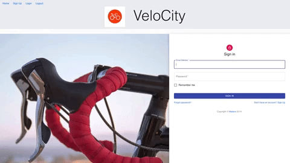
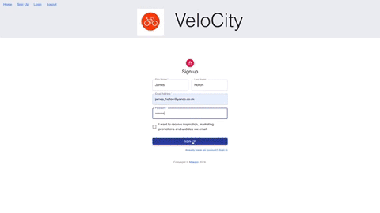
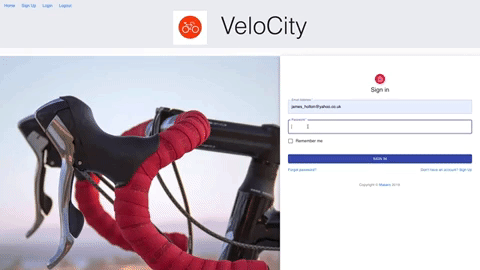
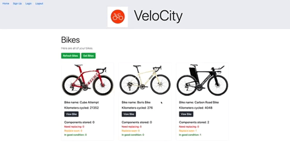

# VeloCity - README

This Bike Component Tracking App was built as a final project of the 16 week Makers Academy Software Engineering course in November 2019. The aim of the project is to work as a team to build a full stack software application that both reinforces the learning of the course to date and demonstrates our skills as junior full stack devs. The exact functionality and technical specifications of the App were down to us to decide.

### Try the app here: [https://velocity-bike.herokuapp.com/](https://velocity-bike.herokuapp.com/)

## What the App has been written for
This application works hand in hand with the Activity Logging site Strava.  The problem we have solved is that knowing how far your bike has ridden does not help you judge whether the components on the bike need replacing.

This App monitors the individual components on a bike, and tracks ther use, letting the user know when they have reached their recommended replacement distance.

Main contributors:

* [Karlo De Guzman](https://github.com/kdeg0040)
* [Gabriel Gonzalez](https://github.com/gabokappa)
* [James Holtan](https://github.com/BigTallJim)
* [Eduard Kulcsickij-Gut](https://github.com/EdZeno)
* [Thomas Ross](https://github.com/Gotteschalk)


## Table of contents
* [Installation](#installation)
* [User stories](#user-stories)
* [Usage](#usage)
* [Approach](#approach)

## Installation
To get a development environment running please clone this repo in your desired directory:
```
$ git clone git@github.com:gabokappa/VeloCity.git
```
- Install gems and dependencies
```
$ bundle install
$ npm install --check-files
$ yarn install
```
- Create development and test env databases and tables
```
$ rails db:create
$ rails db:migrate
$ rails db:migrate RAILS_ENV=test
```
- Start local server and visit ```http://localhost:3000``` in browser to view VeloCity homepage
```
$ rails s
```
## User Stories
### Basic
```
As a bike enthusiast I want to know when I need to change a bike component
As a user I want to log into the application to see personalised information about my bike
As a bike enthusiast I want to know how many miles until I need to change my components
As a user I want to be able to add components to be tracked (input brand, first usage date, lifespan)
```
### Advanced
```
As a user I want to be able to tell the app when I have replaced a part
As a user I want to be able to add a different bike to track its components
As a user I want the app to make recommendations on lifespan
```
## Usage

**SignUp** - Starting on the homepage a new user signs up to the app.




**Authorize Strava** - After sign up the user is prompted to login to their Strava account and authorise VeloCity.
The user is redirected to the VeloCity login page.



**Get Bikes** - The user logs in to VeloCity and retrieves bikes from Strava account through the 'Get bikes' button. Bikes associated with the user's Strava account now appear with the distance they have done in kilometres.



**Add components** - Once the user has their bikes in the VeloCity account, they can view a single bike to add a bike part from a drop down menu. Once the part is chosen there are some fields to fill in which have placeholder values and a suggested lifespan for that part. The part appears in green to show that it hasn't been used much.


**Refresh** - If the user goes for a ride, then logs back in or simply hits 'Refresh' bikes, the kilometres cycled increases and the bike parts have moved to 'replace soon' and 'need replacing' status.



## Technologies Used
| Technology | Description | Use |
| :--------------------------------: | :--------------------------------: | :--------------------------------: |
| Rails ~> v6.0.0 | Web app framework | Back-end API |
| React | JS framework | Front-end user interface |
| Strava API | Fitness activity tracker| Provide user cycling data |
| RSpec | Ruby test framework  | Test Rails models and controllers |
| Jest | React test framework | Test React components |
| Cypress | End-to-end test framework | Test features |
| Postman | HTTP API interface | Simulate HTTP requests |
| ESLint | JS linter | Maintain JS code quality |
| RuboCop | Ruby linter | Maintain Ruby code quality |
| JWT | JSON Web Tokens | Manage authentication |
| PostgreSQL | Database management system | Store app data in database |
| JQuery | JS library | Add dynamic front-end behaviour |

## Approach
For a more detailed view of the team's approach please explore the [wiki pages](https://github.com/gabokappa/VeloCity/wiki)

In summary, we wanted to create a web app that reinforced the knowledge we had acquired at Makers and also strecth our knowledge by using React as a front end because it was library that was new to all of us.

The team prioritised learning over implementation of lots of new features. This meant that we often decided to work in pairs exchanging the pair's focus midway through a sprint for two reasons. 1) This meant every member got exposure to different sections of code and wasn't 'stuck' doing just back-end or front-end. 2) This made sure that each member understood the code that another member wrote.

The team worked in two-day sprints, with each sprint starting with a planning session, either a recap or replanning based on the previous sprint. On a daily basis we had a standup at the beginning and middle of the day, followed by a checkin at the end to understand how things were going and make sure a pair wasn't blocked.

